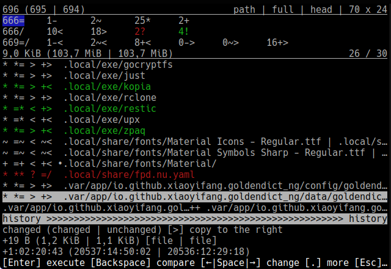
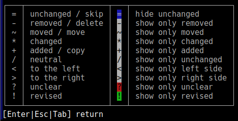

# euaie

- local file synchronization with a functional TUI
- scalable and tiling window friendly layout
- flexible but minimal and easy configuration
- plain and effective filter syntax (no glob or regex)
- tries to minimize complexity of application and codebase
- runs in all terminals on Linux, macOS and Windows
- native executables built with GraalVM Native Image




### usage

```
Usage: euaie [-IQrSV] [-C=<MiB>] [-s=<policy>] [-t=<ms>] [-e[=<s:c:e>...]]...
             [-i[=<s:c:e>...]]... [@<filename>...] <rootL> <rootR>
simple file synchronization
      [@<filename>...]         one or more argument files containing options
      <rootL>
      <rootR>
  -e, --exclude[=<s:c:e>...]   filter syntax: '<starts>:<contains>:<ends>'
  -i, --include[=<s:c:e>...]   filter syntax: '<starts>:<contains>:<ends>'
  -r, --retain                 keep old files in <root>/.euaie/ (false)
  -s, --symlinks=<policy>      set policy for symbolic links (PRESERVE)
                               policies: FOLLOW, IGNORE, PRESERVE
  -t, --tolerance=<ms>         set allowed time difference (0)
  -C, --copy-threshold=<MiB>   set threshold for interruptable copy (512)
  -I, --insensitive            use case insensitive filters (false)
  -Q, --quit                   exit when both sides are equal (false)
  -S, --stateless              ignore previous state (false)
  -V, --version                print version and exit
```

#### examples

dotfiles:  
`euaie ~/ ~/sync/ -r -i .config/ .local/share/ -e .config/too/big .local/share/Trash/`

pictures and videos:  
`euaie ~/Pictures/DCIM /run/media/user/sdcard/DCIM -t=2000 -Q`

all options can be provided by arguments and argument files:  
`euaie @path/to/arguments.txt --quit`

`arguments.txt`:
```
# comments start with #

#roots first
/home/user/
/home/user/Cloud/Sync/

--retain
--insensitive
--symlinks=IGNORE

#include in one line
--include=.config/
#or multiple lines
--include
.local/bin/
.local/share/
Music/

--exclude=Music/::.flac
--exclude
.config/too/big
.config/not/this/path
.local/share/Trash/
::.tmp
```

#### filter syntax for including and excluding paths relative to root

each filter is a string-triple, all three parts have to match a path or can be empty:

- `<starts>:<contains>:<ends>`
- `<starts>::` or just `<starts>`
- `:<contains>:` or `:<contains>`
- `::<ends>`

examples:

- `.config/::.toml` matches all **.toml** files anywhere in **root/.config/**
- `:.git/:` matches all **.git** directories in any location
- `:2026:.flac` matches all **.flac** files with '2026' in their paths
- `path/to/::/file` matches **root/path/to/some/file** but not **root/path/to/file.old**

### build

cross-platform jar:  
`./gradlew shadowJar`

native executable with Gradle:  
`./gradlew nativeCompile`

native executable with Podman/Docker:  
`podman run --rm --volume .:/app ghcr.io/graalvm/native-image-community:25 -jar euaie.jar`

### dependencies

- [Kotter](https://github.com/varabyte/kotter)
- [picocli](https://github.com/remkop/picocli)
- [tinylog](https://github.com/tinylog-org/tinylog)
- [JLine](https://github.com/jline/jline3)
- [Shadow](https://github.com/GradleUp/shadow)

### related

- [Unison](https://github.com/bcpierce00/unison)
- [FreeFileSync](https://freefilesync.org/)
- [Mutagen](https://github.com/mutagen-io/mutagen)
- [Syncthing](https://github.com/syncthing/syncthing)
- [rclone](https://github.com/rclone/rclone)

### comparison

|              | euaie  | FreeFileSync | Unison |
|--------------|--------|--------------|--------|
| language     | Kotlin | C++          | OCaml  |
| version      | 0.26.5 | 14.9         | 2.53.8 |
| LOC (cloc)   | 1228   | 49238        | 40463  |
| LOC UI ratio | 59%    | 47%          | 26%    |

### license

copyright 2026 239 - licensed under the [Apache License 2.0](LICENSE)
